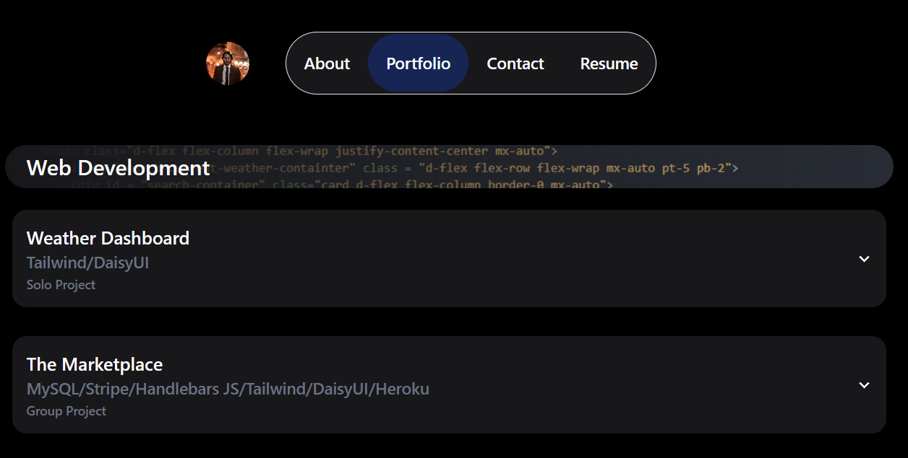

# My Portfolio
This is my portfolio site where you can read about me and view my most recent projects.

## Description
Select "about" to view a short bio, download my resume by selecting "resume" and view my portfolio by selecting "portfolio". You may also contact me through the contact form under "contact"

## Accessing the Application
The application can be accessed on the GitHub repo here: https://github.com/cristino4/My-Portfolio/

The application is also available on its published site: https://cristino4.github.io/My-Portfolio/

## Technologies Used
- JavaScript, CSS, HTML
- React
- Tailwind CSS
- Daisy UI

